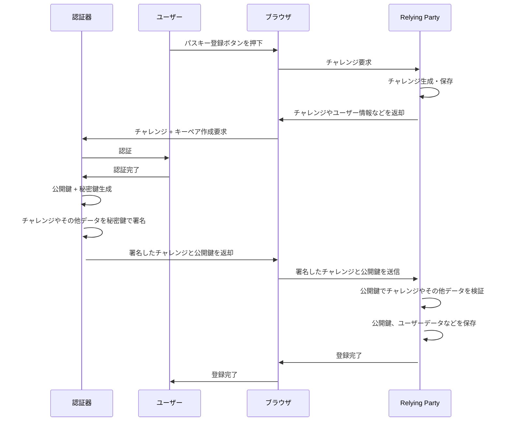
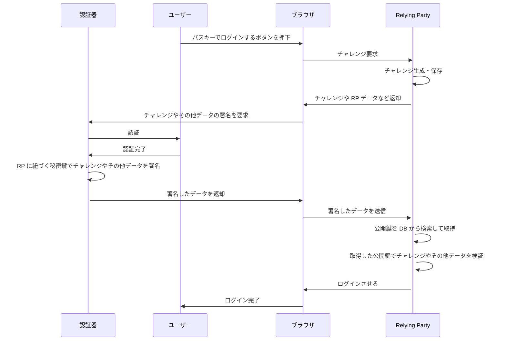

# Simple Passkey Demo

This is the Simple Passkey Demo App.

# How to Start

## Install Ruby gems

```
$ bundle install
```

## Start server

```
$ bundle exec ruby app/main.rb
```

The default is to start up `http://localhost:4567`.

- Specify the URI of the Relying party

```
$ bundle exec ruby app/main.rb https://example.ngrok-free.app
```

Then You can create the Passkey in the domain of the relying party.

# Sequence diagram

## Register Passkey



## Authenticate with Passkey



# URLs used as references when creating this app

- [はじめての WebAuthn](https://developers.google.com/codelabs/webauthn-reauth?hl=ja#0)
- [Web Authentication: An API for accessing Public Key Credentials - Level 2 Recommendation](https://www.w3.org/TR/webauthn-2/)
- [Web Authentication: An API for accessing Public Key Credentials - Level 3 Working Draft](https://www.w3.org/TR/webauthn-3/)
- [Web Authentication: An API for accessing Public Key Credentials - Level 3 Editor’s Draft](https://w3c.github.io/webauthn/)
- [Web Authentication API \- Web API \| MDN](https://developer.mozilla.org/ja/docs/Web/API/Web_Authentication_API)
- [Sequence diagrams · line/line-fido2-server Wiki](https://github.com/line/line-fido2-server/wiki/Sequence-diagrams)
- [パスワードの不要な世界はいかにして実現されるのか \- FIDO2 と WebAuthn の基本を知る](https://blog.agektmr.com/2019/03/fido-webauthn)
